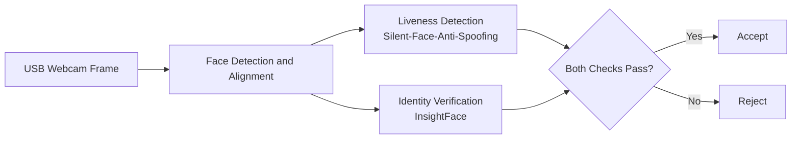

# Facial Recognition Optimization

## Team and responsibilities
| Simion Cartis | Mabel Hurd | Alphanso Davis-Moses |
| -- | -- | -- |
Developer | Developer, Researcher | Business Perspective |

## Feedback
This has been done before. However, a well researched and well executed project can lead to interesting results that can provide extensive knowledge in an in demand area

## Problem and Motivation

Facial authentication is now a standard unlock method on consumer devices, but a trustworthy system has to answer two separate questions, not one: (1) does the presented face match the enrolled owner (identity verification), and (2) is the presented face a live person rather than a printed photo, a screen replay, or a mask (liveness / anti-spoofing). Both checks typically run continuously or on-demand on constrained, battery-powered hardware, which creates a direct tension between model accuracy and the compute/power budget available on-device.

Quantizing a model's weights and activations from 32-bit floating point (FP32) to 8-bit integer (INT8) is a standard technique for reducing model size and, in some cases, inference cost, but it is not free. Reduced numerical precision can degrade a model's decision boundary, and for a security-relevant system that is a change in how often an impostor is wrongly accepted (false accept) or a legitimate user is wrongly rejected (false reject). This makes facial authentication a meaningful case study for the general question of whether quantization is safe to deploy in a context where accuracy failures have direct security and usability consequences, rather than only a general-purpose efficiency question.

This project treats the two required system properties as separate, explicit risks rather than implicit assumptions:
- **Security**: a false accept in either the identity-verification stage or the liveness stage compromises the authentication system.
- **Fairness/robustness**: if quantization's accuracy cost is not evenly distributed (e.g., worse under low-light conditions, or across demographic subgroups where data permits), the system becomes less trustworthy for some users than others, even if its average accuracy looks acceptable.

Because this project involves capturing and processing live facial images of team members and test subjects during evaluation, all image data will be collected with informed consent from participants, stored only within the team's private repository/local hardware, and used solely for model evaluation.

## Research Questions and Hypotheses

**RQ1:** To what extent does post-training INT8 quantization change end-to-end inference latency (p50/p95, in milliseconds) and active power draw (watts) for the identity-verification model (InsightFace) and the liveness-detection model (Silent-Face-Anti-Spoofing) when run on a Raspberry Pi CPU?

**RQ2:** How does INT8 quantization affect biometric accuracy (False Accept Rate (FAR), False Reject Rate (FRR), and Equal Error Rate (EER)) for each model individually and for the combined two-model authentication pipeline, relative to FP32 baselines?

**RQ3:** Is any accuracy degradation introduced by quantization distributed evenly across test conditions, or concentrated in specific subgroups (e.g., low-light vs. well-lit input, and demographic subgroups where labeled data is available)?

**RQ4 (stretch):** Does replacing the default inference runtime with a hardware-optimized execution backend (e.g., ONNX Runtime with ARM NEON, or TFLite with XNNPACK) provide additional speedup beyond quantization alone, isolating the runtime's contribution from the numerical-precision contribution?

**H1:** INT8 quantization will reduce median inference latency and measured power draw relative to FP32 on the Raspberry Pi CPU, but the effect size will be modest, since both source models are already small relative to the device's available compute.

**H2:** INT8 quantization will produce a small but measurable increase in EER for at least one of the two models; the liveness model is more likely to show degradation than the verification model, since anti-spoofing decisions rely on fine-grained texture and frequency-domain cues that are more sensitive to reduced numerical precision than the coarser embedding-distance decision used for verification.

**H3:** Quantization-induced accuracy loss will not be uniform across conditions. We predict it will be measurably larger under low-light input than under well-lit input, because a compressed low-precision representation has less headroom to correctly separate signal from an already-degraded (noisier, lower-contrast) input.

## Related Work

**Deng et al., "ArcFace: Additive Angular Margin Loss for Deep Face Recognition" (CVPR 2019).** This paper introduces the angular margin loss underlying the ArcFace/MobileFaceNet family of models distributed through the `deepinsight/insightface` repository. We rely on its pretrained FP32 checkpoints as the identity-verification backbone in our pipeline. Our project does not modify or extend the loss function or architecture; it differs by studying the effect of post-training quantization on models trained with this method, which the original paper does not address.

**`minivision-ai/Silent-Face-Anti-Spoofing`.** This open-source liveness-detection system (MiniFASNet family) classifies a presented face as real, a 2D spoof (printed photo/screen replay), or a 3D spoof (mask), and is explicitly designed to prevent presentation attacks against facial-identification systems such as phone unlock. We rely on its pretrained FP32 weights as our liveness-detection component and treat its reported real/fake classification behavior as our accuracy baseline before quantization. Our project differs by evaluating how that classification behavior changes after INT8 quantization, which is outside the scope of the original repository.

**Jacob et al., "Quantization and Training of Neural Networks for Efficient Integer-Arithmetic-Only Inference" (CVPR 2018).** This paper defines the post-training and quantization-aware integer quantization scheme implemented in TensorFlow Lite, which we use as our quantization methodology. We rely on its integer-arithmetic inference scheme directly; our contribution is not a new quantization method but an empirical accuracy/efficiency/fairness evaluation of applying this existing method to a two-stage biometric authentication pipeline.

**Buolamwini & Gebru, "Gender Shades: Intersectional Accuracy Disparities in Commercial Gender Classification" (FAT* 2018).** This paper establishes both the methodology and the motivation for evaluating face-related model accuracy by subgroup rather than by aggregate accuracy alone. We adopt its subgroup-evaluation framing for our fairness analysis (RQ3); our project differs in scope and model class; we study quantization-induced disparity in a verification/liveness pipeline rather than disparity in commercial gender-classification products.

## Proposed System or Approach

The system is a two-stage facial authentication pipeline running on a Raspberry Pi with a USB webcam as the sole sensor input:

**Components:**
- **Face detection/alignment**: crops and aligns the incoming webcam frame to the fixed input size each downstream model expects (a standard, reused preprocessing step, not a team contribution).
- **Liveness detection** (reused system: `minivision-ai/Silent-Face-Anti-Spoofing`, MiniFASNet architecture): classifies the aligned face as real or spoofed (2D/3D).
- **Identity verification** (reused system: `deepinsight/insightface`, ArcFace/MobileFaceNet architecture): computes a face embedding and compares it via cosine similarity against a stored enrolled-user embedding, thresholded to accept/reject.
- **Decision logic** (team contribution): combines both checks — an attempt is only accepted if the face is both classified as live *and* matched to the enrolled identity above threshold.
- **Quantization pipeline** (team contribution): converts each model's pretrained FP32 weights to INT8 via post-training quantization (with a calibration dataset), producing a matched INT8 version of each model for direct comparison against its FP32 original.
- **Benchmarking harness** (team contribution): runs both FP32 and INT8 versions of each model, and the combined pipeline, over a fixed test set on the Raspberry Pi, logging latency, power, memory, and accuracy outcomes.

**Inputs:** live webcam frames (for the interactive demo) and a fixed, versioned set of recorded/labeled test images (for controlled accuracy evaluation).
**Outputs:** an accept/reject decision per attempt (demo), and structured logs/metrics per model per precision (evaluation).

**Team's contribution, stated explicitly:** we are not training new face-recognition or anti-spoofing models. Our contribution is the quantization pipeline, the combined two-model decision system, the Raspberry Pi deployment, and the controlled FP32-vs-INT8 evaluation across efficiency, accuracy, and fairness dimensions described below.

## Evaluation Plan

**RQ-to-experiment mapping:**
- RQ1 (efficiency) → Experiment A: latency/power/memory benchmarking, FP32 vs. INT8, both models independently and combined.
- RQ2 (accuracy) → Experiment B: FAR/FRR/EER evaluation, FP32 vs. INT8, both models independently and combined pipeline.
- RQ3 (fairness/robustness) → Experiment C: subgroup breakdown of Experiment B's results by lighting condition (controlled) and, where labeled data permits, demographic subgroup.
- RQ4 (stretch) → Experiment D: runtime-backend comparison (ONNX Runtime/NEON vs. TFLite/XNNPACK) at fixed INT8 precision.

**Datasets and workloads:**
- Verification accuracy: a standard face-verification benchmark with a published positive/negative pairs protocol (e.g., LFW), used to compute FAR/FRR/EER for the identity-verification model at each precision.
- Liveness accuracy: a labeled set of real vs. spoofed (printed photo, screen replay) presentations, combining a subset of an existing public anti-spoofing benchmark with a small, consented set of team-captured images for the live demo and lighting-condition tests, such as the class. We may also utilize faces created by "This Person Does not Exist" (https://thispersonnotexist.org/)
- Efficiency workload: a fixed, repeated sequence of webcam frames run through each model configuration on the Raspberry Pi for latency/power/memory measurement.

**Baselines and ablations:**
- Baseline: each model's original FP32 weights, unmodified.
- Treatment: post-training INT8 quantized version of each model.
- Optional secondary baseline: FP16 quantization, to check whether INT8's accuracy cost (if any) is disproportionate relative to a milder compression step.
- Ablation: each model evaluated independently, and as part of the combined two-model pipeline, to separate each model's own accuracy change from compounding effects across the pipeline.

**Controlled and varied factors:**
- Controlled: hardware (single fixed Raspberry Pi unit), webcam, face-detection/alignment step, decision threshold selection method.
- Varied: numerical precision (FP32 vs. INT8, optionally FP16), lighting condition (well-lit vs. low-light), and, where data allows, demographic subgroup.

**System and quality metrics:**
- Latency: end-to-end p50 and p95 inference time in milliseconds, covering detection, alignment, and feature extraction.
- Power: active device power draw in watts, measured via an inline USB/GPIO power meter.
- Memory: runtime Resident Set Size (RSS) in megabytes.
- Model size: on-disk binary footprint in megabytes, per precision.
- Accuracy: FAR/FMR, FRR/FNMR, and EER (percentages), plus True Accept Rate at a fixed operating point (e.g., TAR @ FAR = 0.1%).

**Hardware and software environment:** Raspberry Pi (model, RAM, and OS version to be determined), USB webcam, USB or GPIO-based power measurement device, Python with PyTorch/ONNX Runtime and TFLite runtime, exact library versions will be pinned in a requirements file.

**Trials/seeds and variability reporting:** each latency/power measurement will be repeated over a minimum of 500 inference runs per configuration (after a fixed warm-up period excluded from reported numbers), with median, p95, and standard deviation reported. Accuracy metrics will be computed once per fixed test set per configuration, since these are deterministic given fixed weights and a fixed test set; any stochastic component (e.g., calibration-set sampling for quantization) will be run with a minimum of 3 different calibration seeds to check sensitivity.

**Planned plots and tables:**
- ROC and DET curves (FP32 vs. INT8), per model and combined pipeline.
- Pareto frontier scatterplot (accuracy vs. latency) across precision configurations.
- Subgroup degradation plot (EER by lighting condition, and by demographic subgroup where available), FP32 vs. INT8.
- Summary table: latency, power, memory, model size, and FAR/FRR/EER, per model per precision.

**Success criteria and interpretation of negative results:** Quantization will be considered a worthwhile trade-off for this system only if INT8 reduces power draw and/or p95 latency by a clearly reportable margin while keeping EER within a small, explicitly stated tolerance (e.g., no more than a few percentage points of absolute EER increase) and without concentrating that increase disproportionately in one subgroup or lighting condition. If quantization yields negligible efficiency benefit, because the models are already small relative to the Raspberry Pi's compute budget, that is a valid, reportable negative result, and will be presented as such rather than reframed as a positive one.

## Expected Deliverables

- Source code for the quantization pipeline (FP32 → INT8 conversion scripts for both models).
- Source code for the combined two-model decision pipeline running on the Raspberry Pi.
- Automated benchmarking/evaluation scripts (latency, power, memory, accuracy).
- Quantized (INT8) model files for both the verification and liveness models.
- Raw and processed results (CSV/JSON logs of all measured runs).
- Generated figures: ROC/DET curves, Pareto frontier plot, subgroup degradation plots.
- A short recorded demo of the live Raspberry Pi prototype accepting/rejecting an authentication attempt.
- The final written report.

## Timeline and Milestones

| Period | Milestone | Evidence of Completion | Owner(s) |
|---|---|---|---|
| Week 1 | Reproduce FP32 baseline for both models on the Raspberry Pi | Both models run end-to-end on a test image and produce a valid decision | Team |
| Week 2 | Build INT8 quantization pipeline; pilot accuracy check | INT8 versions of both models produced; pilot EER comparison run on a small sample | Team |
| Week 3 | Full efficiency benchmarking (latency/power/memory) | Logged, repeated measurements for FP32 and INT8, both models | Team |
| Week 4 | Full accuracy benchmarking (FAR/FRR/EER) and combined-pipeline evaluation | ROC/DET curves produced for both precisions, individually and combined | Team |
| Week 5 | Subgroup/fairness evaluation (lighting, demographic where available) | Subgroup degradation plot produced | Team |
| Week 6 | (Stretch) Runtime-backend comparison (ONNX Runtime NEON vs. TFLite XNNPACK) | Comparative latency numbers at fixed INT8 precision | Team |
| Week 7 | Analysis and report drafting | Final figures and interpretation drafted | Team |
| Week 8 | Final report, demo recording, and submission | Complete report, demo video, and repository finalized | Team |

## Risks and Mitigations

| Risk | Early Warning Sign | Mitigation | Fallback |
|---|---|---|---|
| Post-training INT8 quantization causes an unacceptable accuracy drop in one or both models | Pilot EER (Week 2) increases substantially over the FP32 baseline | Test PTQ accuracy early, before the full sweep; try per-channel quantization and compare static vs. dynamic quantization | Fall back to FP16 quantization for the affected model, or scope the accuracy claim to whichever model quantizes cleanly |
| No meaningful efficiency benefit is observed because both models are already small relative to the Raspberry Pi's compute budget | Week 1–3 baseline FP32 latency/power is already low relative to the device's overall budget | Reframe the efficiency question around sustained/continuous inference (simulating a background liveness-scanning workload) rather than one-shot latency | Report the null efficiency result honestly, with full methodology, as a valid finding about model size vs. available hardware headroom |
| Labeled data for demographic-subgroup fairness testing is unavailable, restricted, or requires consent processes that delay the project | No accessible, appropriately licensed dataset with subgroup labels identified by Week 2 | Prioritize an existing academic verification benchmark with documented demographic annotations; supplement with a small, consented team-captured set for lighting-condition testing only. Utilize faces generated by "This Person Does not Exist" | Narrow the fairness claim (RQ3) to lighting condition alone, which the team can generate and control directly |
| The two-model pipeline compounds errors in ways that make the source of degradation hard to attribute | Combined-pipeline FAR/FRR is substantially worse than either individual model's reported metric | Report each model's metrics independently as well as the combined-pipeline metric, so degradation sources remain traceable | Report the combined-pipeline result only, with pipeline compounding noted explicitly as a limitation |
| Hardware-optimized runtime comparison (RQ4/Experiment D) consumes disproportionate engineering time | Runtime-backend integration is not functional by the Week 6 checkpoint | Timebox this comparison strictly as a stretch goal, not a core deliverable | Drop RQ4 entirely and report results using a single, working runtime backend |

## Reproducibility Plan

- **Dependency versions**: exact Python, PyTorch, ONNX Runtime, and TFLite versions will be pinned in a `requirements.txt`/environment file committed to the repository.
- **Hardware**: exact Raspberry Pi model, RAM, OS version, webcam model, and power-measurement device will be recorded in the README.
- **Random seeds**: calibration-set sampling seeds for quantization will be fixed and recorded; all seeds used will be listed in the configuration files.
- **Configuration files**: quantization settings (calibration set size, per-channel vs. per-tensor, static vs. dynamic) and evaluation thresholds will be stored as versioned config files, not hardcoded.
- **Dataset versions**: the exact version/subset of each benchmark dataset used, and the exact list of any team-captured images (with consent documentation kept separately and not distributed), will be recorded.
- **Commands and raw results**: all benchmarking commands will be scripted (not run manually) and raw output logs will be committed alongside processed results and analysis notebooks/scripts.
- **AI assistance disclosure**: the team used an AI assistant (Claude) during project scoping to evaluate hardware/model trade-offs and identify feasibility risks (e.g., quantization approach, hardware selection). Any use of AI coding assistance during implementation will be noted in the final report per course policy.

## References

1. Deng, J., Guo, J., Xue, N., & Zafeiriou, S. (2019). ArcFace: Additive Angular Margin Loss for Deep Face Recognition. *CVPR 2019*.
2. Minivision AI. Silent-Face-Anti-Spoofing [Software repository]. https://github.com/minivision-ai/Silent-Face-Anti-Spoofing
3. Jacob, B., Kligys, S., Chen, B., et al. (2018). Quantization and Training of Neural Networks for Efficient Integer-Arithmetic-Only Inference. *CVPR 2018*.
4. Buolamwini, J., & Gebru, T. (2018). Gender Shades: Intersectional Accuracy Disparities in Commercial Gender Classification. *Proceedings of Machine Learning Research (FAT* 2018)*.
5. DeepInsight. InsightFace [Software repository]. https://github.com/deepinsight/insightface
